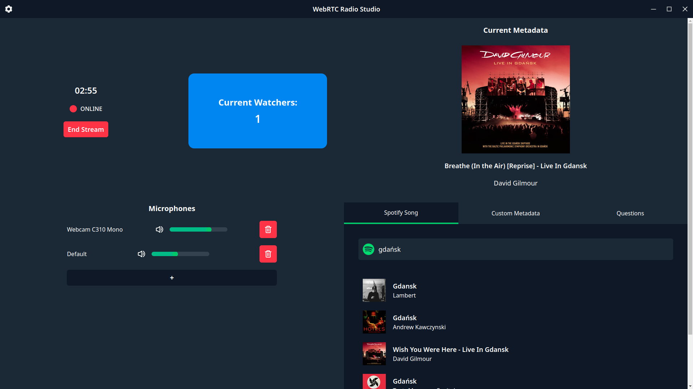
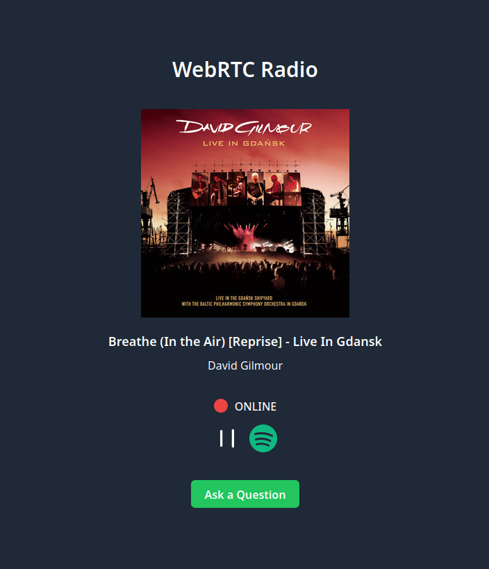
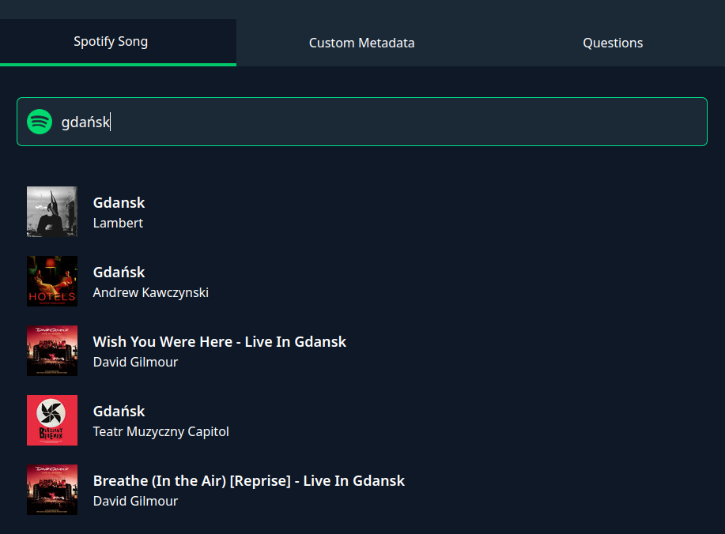
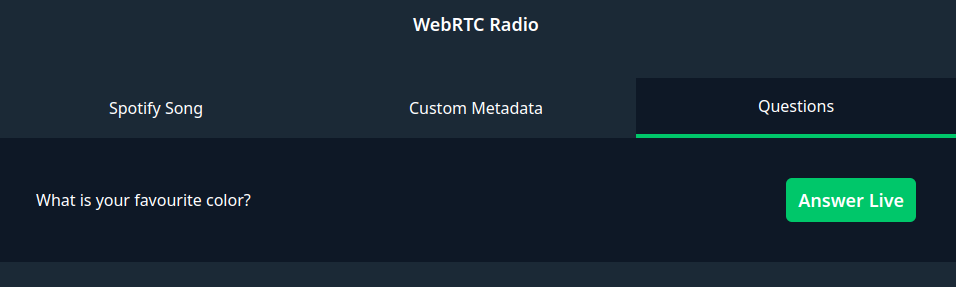
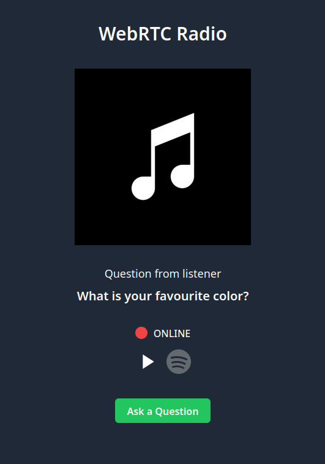
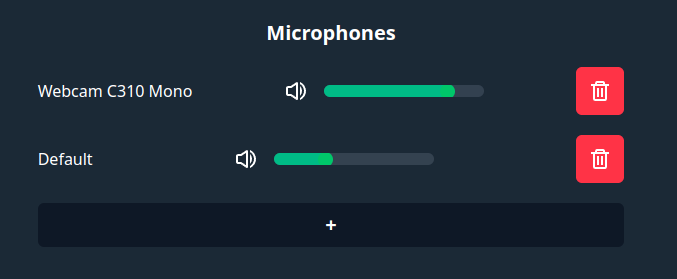
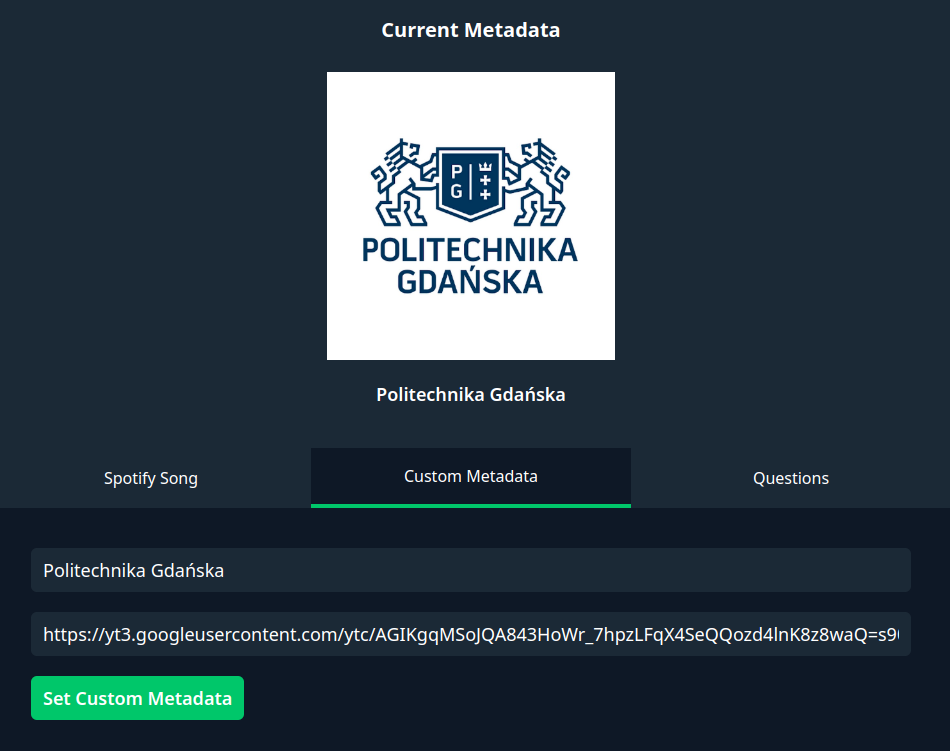

# WebRTC Radio

This projects consists of a desktop studio app, used for streaming audio and complimentary metadata, as well as a web client where users can listen to the transmissions.

## Studio App



## Web Client



## Features

- **Spotify Integration**
  - From the studio app you can search for songs on Spotify and display them as metadata on all connected web clients. <br />
    
  - From the web app, when you click on the Spotify icon, you will be redirected the their login page.
    After successfully authenticating, you will be able to save any song you want from the audition to a special playlist. When a song is saved, the button turns green.
- **Questions from listeners**
  - From the web client you can click the `Ask a Question` button, type one in, and press enter.
  - In the studio app questions are visible under the `Questions` tab on the right. <br />
    
  - Clicking the `Answer Live` button will display the question for all connected users and remove it from the list. <br />
    
- **Multiple Input Audio Devices**
  - Using the plus/trash button you can add/remove audio sources from the studio app.
  - With the volume sliders you can balance them out. <br />
    
- **Custom Metadata**
  - From the `Custom Metadata` tab you can specify any image and/or text to display as metadata on all clients. <br />
    

## Used technologies/Architecture

The project is written in [Typescript](https://www.typescriptlang.org/). Audio transfer is performed with the [WebRTC](https://webrtc.org/) protocol.
The studio app was made in [Electron](https://www.electronjs.org) and [Svelte](https://svelte.dev/). It runs a [Socket.io](https://socket.io/) server in the background, which is
necessary to negotiate and establish a peer-to-peer connection. The web app is also written in Svelte. Both parts use [Tailwind CSS](https://tailwindcss.com/) for styling.

## Running

Both the Studio App and the Web App require a Spotify_Client_Id and Spotify_Client_Secret to interact with the Spotify api. You can provide them as environment variables in a
.env file, located at the root of `web` and `studio` folders.

```
.env

SPOTIFY_ID=<spotify api id goes here>
SPOTIFY_SECRET=<spotify api secret goes here>
```

**Studio App**

```
cd studio && npm run start
```

**Web App**

```
cd web && npm run dev
```
